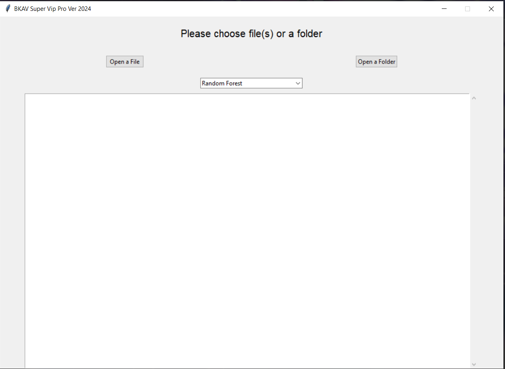
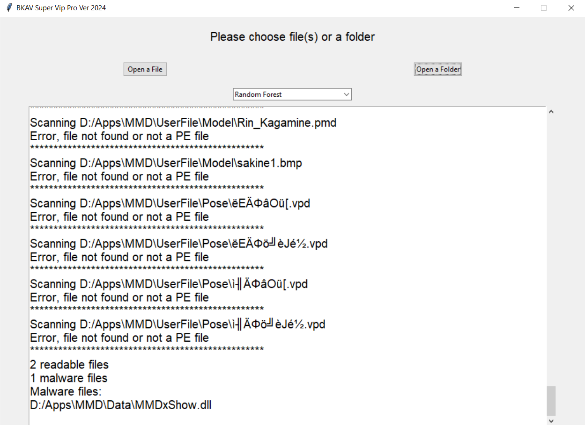

# Malware-Detection
This project aims to correctly detect malware from a set of PE files.
# Installation & running guide:
## Prerequisites:
This project assumes Python 3.11 was used. Used package:
- sklearn
- pefile
- torch
- ...
All of the used package are stored in the requirement.txt file.
## Installation guide:
- Install the source code and extract to a folder
- Optinal: extract the true_sample.rar to somewhere, should be inside the source folder. The true_sample.rar contains many benign/malware sample for you to test. Note that the true_sample.rar is only sent inside the rar of the assignment.
- Open CMD in the main folder, which should be the malware-detection folder. Your current location should look like this:
```bash
C:\abcxyz\...\Malware-Detection>
```
## Running guide:
- For the UI version: run the command:
```bash
python src/ui.py
```
After that, the UI should look like this:

Choose a model to run in the middle part, and then choose one of the two type: a single file or directories. After that, any relevant data should be print out in the UI. For example:

- For the ipynb verion: run the notebook run-model, located in src. The instruction are saved there, please read and follow it.
## Folder structure:
- Datasets: contains the dataset:
    + CLaMP_Raw: the unprocessed dataset
    + CLaMP_Integrated: the processed dataset
    + CLaMP_In_Selected: the processed dataset, after applying feature selection. This was used to train/test/validate the models.
- old: old files
- src:
    + images: many images contains experiments on the models,mostly consist of graph when doing validating models
    + models: the saved models in joblib or pickle form
    + notebooks: mostly consist of notebooks that we used to test the models. The result are saved there to save time for the users. Also contains some .py file of neural networks, that are used to help with loading models.
    + self: many notebook/files for testing, mostly redundant for checking.
    + tools: the tools that are used, mostly for converting input from raw file and process the dataset.
## Sidenote:
- The malware are real! Please care to not accidentally run any of the malware. You should have an antivirus on, but do not delete the file, make the antivirus stop you when execute any of that malware.
- If you don't sure which file is malware or not, drop the file on VirusTotal website.
- When inputing any files to test for the data, beware of many exception that depend on your own computer, for example "Access denied". We have catch every exception that we found, but maybe there can be some uncatched one. In that case, just test on others files, best be your own files and not the system's
- When reading many of the notebook, you may catch glimpse of some data related to multiclass classification. We have tried to do that, but as the data and result are grim, we decide to stop doing multiclass classification. There may be some unremoved note on that, please ignore it.


